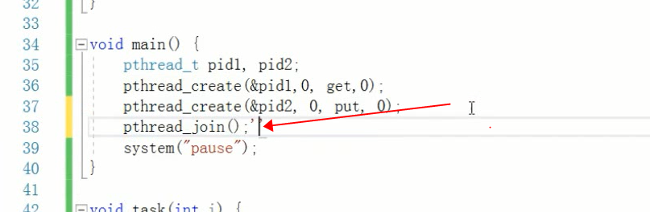

vs安装，可在 工具 中扩展插件；


成对;

	malloc(p)...
	
	free(p);
	p = NULL; //一定要置空；

### 数组指针和指针数组

[https://www.cnblogs.com/hongcha717/archive/2010/10/24/1859780.html](https://www.cnblogs.com/hongcha717/archive/2010/10/24/1859780.html)

[https://www.cnblogs.com/mq0036/p/3382732.html](https://www.cnblogs.com/mq0036/p/3382732.html)

[https://www.jianshu.com/p/3b6d0219c511](https://www.jianshu.com/p/3b6d0219c511)

数组指针，**也称为行指针**

数组解引用：

​		`arr[i]  = *(arr+i)`

二维数组获取i行j列,

二维数组array\[m\]\[n\] : m表示一共有m行，n表示一共有n列； 

(*(array + m) + n) =  \*(array[m] + n) = (\*(array+m))\[j\] = array\[m\]\[n]

## 指针分类

常变量,常量指针,指针常亮,指针函数,函数指针,指针数组,数组指针,函数指针数组分辨

[http://www.lizhiheng.org/?p=120](http://www.lizhiheng.org/?p=120)

> 从右往左看；const 只能修饰char，不能修饰* ？ 所以第一句和第二句是一样的；  第四句和第五句是一样的；

char tmp[] = "hello";

1. const char * p1 = tmp,

   p1[0] = ‘H'  不对；   p1= "dongnao" 对

2. char const * p2, 

   同上

3. char * const p3，

   p3[0] = 'H' 对；  p3= "dongnao", 不对

4. char const * const  p4

   啥都不能变

5. const char * const p5;

   同上；

### 多级指针


### 注意

声明指针时候的* 和 解引用的*是两个概念，注意了；

C是没有函数重载的；


*号解引用可以抵消&

typedef定义的为type类型，只能用来声明，不能直接用来使用，比如typedef一个函数类型为Func不能直接Func(args,...)，只能先用Func 声明一个函数， Func fun， 然后fun(args,...);

函数指针是指向函数的指针变量

预处理器，替换文本；


函数：

> #### 普通函数


> #### 宏函数


> #### 内敛函数


ASCII码，对是0，对应的字符是（Null），其实就是‘\0’，

char * string,  string最后会加个\0


结构体

访问全部是public

注意先定义短字节，再定义长字节；

```
struct Student{
	int32_t age;
	char *name;
}s1,s2;

typedef struct{
	int8_t age;
	char *name;
}Student1;

使用的时候，在C当中，struct Student student;
C++当中，Student student；

```

字节对齐（非默认）；

windows：

```
#pragma pack(2) 以两个字节来对齐

#pragma pack()
```


mac：

```
__attribute__((aligned(2),packed))


```


**自然对齐（默认对齐）；**

以结构体中最大的字节数的那个数据的长度为对齐方式；

是编译器为了优化存取数据的效率；


共用体,在相同的内存位置，存储不同的数据；

内存所占大小：最大成员的字节大小；

union MyUnion{

}; 

c++引用， 相当于一个别名，可以通过引用来修改变量；

#include <iostream> 中包含了<string>

堆当中，对象使用方法要用->

	string *abc = new string("dadddd");
	
	//注意对这种写法的理解
	const char* str = (*abc).c_str();
	
	cout << str << endl;
	
	cout << abc->c_str() << endl;


如果不放到堆中，那么变量出栈就会被释放；

### **但是有一个疑问，如果在一个方法中，new了一个对象，并且返回这个对象，那么这个对象在什么时候delete？** 

debug ：rvo 优化

release：nrvo 优化

拷贝函数：

c++`有方法重载`；


***

## C++  面向对象

引入c头文件

```
external "C"{
 #include "abc.h"
};
```

- 防止头文件重复include

> ifndef/define/endif 的含义：如果未定义 / 那么定义 / 完成假设，一般是用来防止头文件被重复包含，提高编译效率的。

c++ 创建对象，就是一个域::

Student::show()

析构函数，自动调用；比如定义在栈里头的，出方法被析构；


​	

```
创建对象，调用构造函数的时候，顺便把对象的i和j属性给初始化了；
Student::Student(int i,int j): i(i),j(j){	

}
```

普通成员方法：

```
void Student:show(){
}
```


```

```

普通成员函数后面加const ： 常量函数，不能修改类当中任何成员；

```
void Student::show() const{

}

//不能修改返回后的值
char const *getValue() const{
	return "aabb";
}
```

修改类中private属性的变脸，1，创建一个public的方法去修改该属性  2，友元函数 ,类中定义友元函数

```
友元函数 friend void test(Student * );

```

友元类：

​	在类中定义友元类；友元类中，所有的方法都是友元函数；

malloc、new

delete释放以后，并且把对象置位NULL

静态属性、静态函数、单例模式；


***


### 

并且下完成以下的快捷键；

C++单例模式？

C++11，会保证内部静态变量的线程安全；  静态变量可以属于一个域下；

静态成员属性和java的区别：

单例的静态成员变量，在cpp文件那种写法是什么意思？

运算符重载：


什么情况使用new？ 

什么情况需要在堆中申请内存？


指针和对象的区别：

指针：指向一块内存，本身的值是地址

对象：就是一块内存的别名；

### 继承


私有继承（默认）：父类的public、protected这两种方法都变成了 private，不能调用父类的方法；

​		意义：重写父类的方法，重新定义行为；子类在复写父类方法需要调用父类的方法： Parent::method(); 没有super

共有继承：

​		

```
静态多态：在编译期间，就确定了函数的调用地址；
Parent *p = new Child;
p -> test(); // 调用的是父类的test

动态多态：运行期间确定，虚函数，调用的时候，运行时确定；
在parent的 test()方法前面加上virtual，虚函数；
构造方法不能设为虚函数；
析构方法一定要设为虚函数，否则调用父类的虚构函数；
其他的看需求，一般设为虚函数，确保调用子类的方法；

```

纯虚函数：

virtual void test() = 0;  类似于java的抽象方法； 一定要在子类中实现；


### 模板编程：

如果一个类有多个函数重载，并且这些函数的行为一样，那么参数可以用泛型；

函数模板：

template <typename T>

T method();

类模板：

```
template <class T,calssE>
class Student{
	public:
	Student(int a,int b);
}
```

### 以上在栈上创建Student，可以直接这么写 Student(1,2)

模板类，使用模板类，指定。。。


### 容器

vector.clear后，容量不变，只增不减；

vector.clear后，需要vector<int>().swap(vec);  //替换vec，让他容量大小为0;

vector<int>().method =   vector<int> v,   v.method

vector list  dequeue 三种方法差不多；

c++，结构体中可以写函数；可以看成类；

set、map

红黑树

维基百科有各种处理情形；

### 类型转换

1. 强制转换

2. const_cast

3. static_cast

   编译时确定；

   static_cast 转换以后，如果父类方法不加virtual，那么子类也可以调用到自己的方法；静态编译的时候就可以确定

   

4. dynamic_cast

   安全转换；

   动态绑定，运行时确定类型；

   

5. reinterpret_cast

6. auto关键字

atoi   atof

itoa


### 异常

### 文件流


## 多线程

### POSIX

线程标准接口，一般用于Unix、Linux，在Windows上面需要去下载相关的库；

pthreads


intellij,当中的clion开发c++

[下载地址](https://www.jetbrains.com/clion/)

分离线程：

默认为非分离线程：各玩各的；不能被join

线程调度和优先级


#### 线程安全问题：


### 智能指针： c++11

共享智能指针，内部实现了引用计数，

shared_ptr<A> shared_a(a);

 // 用了智能指针，不用写delete a，也能释放a；

多个智能指针指向相同对象的时候，

```
void testPtr(){
	A *a = new A;
	shared_ptr<A> shared_a(a); // a的引用计数 1
	shared_ptr<A> shared_b(a); // a的引用计数 2
	//delete a;
	//出方法了以后shared_a和shared_b会被回收； 如果引用计数为0，会自动delete a
}
```

weak_ptr

unique_ptr

nullptr


**前六章全部学完后，开始解决问题和写东西；**


### 没搞明白的问题：

- 先完成visual studio下面的需要

- 配置ffmpeg、配置POSIX

- 拷贝函数

- SysWow64和System32

- 查看下vs是64位还是32位的；vs运行的时候可以选择32或者64，本身环境有没有32和64的说法；

- 单例模式在cpp对instant的初始化

- 挺奇怪的，做了个例子，返回一个栈对象，都已经析构了，但是还是能用该对象操作，并且内存地址一样；

- vector的操作，主要是看下加入和取出的顺序；push、pop、取出队头、队尾，队头、队尾的含义；

- 容器类用指针指向会怎么样？

- priority_queue，优先级队列的使用，使用场景，自定义排序规则；

- 迭代器，解决for循环删除

- set\map 的遍历

- auto关键字

- c++构造对象的所有写法

- %#x 是以16进制数打印变量吗

- vs显示内存，搜索内存地址；窗口区块调节舒服点；左下角，运行后会显示内存1

- cmakelis 当中的set一个宏是什么（posix第一节）

- pthread 传递参数，函数指针再看一下；

- pthread_attr_t 已经是个指针，这种情况下，pthread_attr_t attr 和 pthread_attr_t  *attrP 有什么区别，为什么?还有智能指针的写法，为什么没有出现\*号，为什么是那种写法 A *a = new A;  shared_ptr<A> shared_a(a) ？ pthread_attr_t attr = NULL要直接赋予NULL？ typedef struct pthread_attr_t_  *pthread_attr_t 这种写法什么意思？

  为什么 pthread_attr_t attr = NULL，还能接着pthread_attr_init(&attr);  ?????? 可能这里不是赋值，而是在init函数中把值给attr

- 线程安全问题，操作数据，互斥锁；

- 动态链接库放在目录文件下，不要放在windows当中；

- 线程池

- http相关；

- 实现SafeQueue 看作业；实现生产者和消费者模式，java记得也用不同方式，synchronize ReentrantLock blockingQueue 试一下； 并且多找几个场景；找个复杂点的；以下为什么要写join,  要仔细理解下join的意思

  

- 上锁判断是否为空的地方，为什么用while，不用if，想一下；

- 写个简单的网络应用，要么断点下载好了；或者还有请求队列，失败重试；

- 手写智能指针；

- new Student 和 new Student(a,b)

- c++什么时候会调用拷贝构造函数

- 自定义智能指针的写法

- weak_ptr

- unique_ptr

- nullptr c++多少

- auto c++多少

- decltype c++多少

- lambda c++多少  函数指针

- 作业 见多级智能指针.md 实现队列;

- 以下；


### Visual studio 使用：

- 注释，单行注释，多行注释，方法**注释

  ctrl+/  注释

  ctrl+shift+/ 取消注释

  方法注释： 敲入/*  会自动变成/**/ 然后按下enter就行；

  ```
  方法注释
  /*
  这样子就行了
  */
  ```

- 

- 输入完成后enter直接拿到提示的   pass

  OK

- 最大化最小化

  已和as一样，ctrl+shift+f12 

- 展开收起代码

  ctrl+M

- 复制一行

  ctrl+d

- 删除一行到头部

  

- 移动一行到上面下面；

- ctrl+箭头选中代码

- 自动重命名；

- 选中多行；

  shift+ 箭头

- 跳转、跳回

- 查找引用

- 日志过滤

- 直接添加一个类，.h+.cpp

- vs输出到vs中，日志强大一点


### 后面开始，每个小章节或者一旦出现需要练习的地方，那就得练习了，一节一练；


### C++一些第三方的合集：

[https://www.jianshu.com/p/f7a652efbb0c](https://www.jianshu.com/p/f7a652efbb0c)